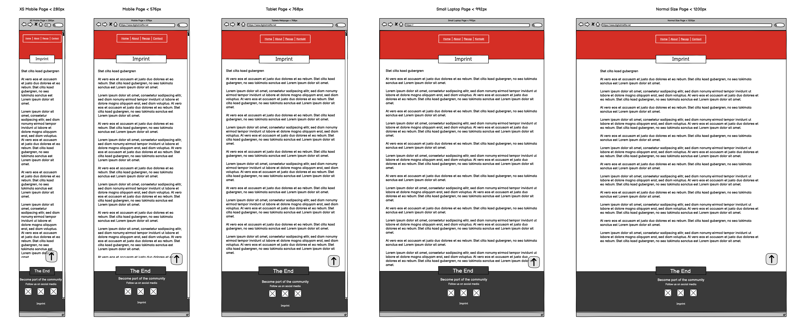

<h1 align="center">Digital Misfits Website</h1>

[Find the deployed project here](https://dennisschenkel.github.io/PP1/)

Digital Misfits is an online community and conference with regular events in Germany. The aim of the initiative is to reach unconform and overlooked talents in a digital working world and companies in search for these talents, as well as interested in topics covering the newest developments in the world of digital work. Since the mayority of communication of the initiative is done on social media, the website is created to inform about the background of Digital Misfits and show recaps of events that happend in the past. With a contact form visitors can send a message to be invited to upcomming events and become a part of the community.

## Table of Contents

* [User Experience](#user-experience-ux)
  * [User Stories](#user-stories)

* [Design](#design)
  * [Color Scheme](#color-scheme)
  * [Typography](#typography)
  * [Imagery](#imagery)
  * [Wireframes](#wireframes)

* [Features](#features)
  * [General Features on Each Page](#general-features-on-each-page)
  * [Accessibility](#accessibility)

* [Technologies Used](#technologies-used)
  * [Languages Used](#languages-used)
  * [Frameworks, Libraries & Programs Used](#frameworks-libraries--programs-used)

* [Deployment](#deployment)

* [Testing](#testing)
  * [Validator Testing](#validator-testing)
  * [Lighthouse Testing](#lighthouse-testing)

* [Credits](#credits)
  * [Code Used](#code-used)
  * [Content](#content)
  * [Media](#media)
  * [Acknowledgments](#acknowledgments)

## User Experience (UX)

The Digital Misfits website is build to educate visitors about Digital Misfits, show recaps from past events and make them curious about future events. This should be achieved with a simple and clean design. Since the mayority of interaction of the community is happening on social media, the website should not distract from these channels and only offer basic functionalities.

### User Stories

#### First time visitors should be able to
- To visit the website from devices with resolutions from small to large.
- To be educated about Digital Misfits.
- To get a feeling for what kind of community and events Digital Misfits offers.
- To easily send a message to get invited to future events.
- To find links to social media chanels.

#### Returning visitors should be able to
- To easily connect with the team by sending a messige with a form.

#### All visitors on the Index page should be able to
- To navigate the website sections with the main menu.
- To go back to the top by clicking an icon that is static in the right bottom corner.
- To start and pause a event recap video.
- To open pictures from a gallery of small thumbnails in a popup.
- To send a message by using a form.

#### All visitors on the Imprint page should be able to
- To visit the imprint site with a link in the footer.
- To leave the imprint site by using the main menu.

## Design

For the overall website structure I choose an onepager with one additional subpage for the imprint that is mandatory in Germany.

### Color Scheme

The color scheme is based on only three colors. Red, Black and White.
The colors are part of the CI of Digital Misfits since 2017 and should be used for the web presence.
All three colors where choosen to create a strong contrast and create a simple and relatively flat design. Only three colors are used for not interrupting the user in his focus in the content by design aspects.

### Typography

For the Digital Misfits website primarily the font Lato is used in different weights.

- Lato offers a clean and easy to read style and at the same time not to common.

Weights used are:
- H1, H2, H3: 600
- Paragraph: 400

Fonts are imported from [Google Fonts](https://fonts.google.com/)

### Imagery

- All images used on the website where taken at Digital Misfits events.
- Use of other images is not planed.

### Wireframes

Wireframes for the index.html site.

Wireframes for the imprint.html site.

- Final design might slightly deviate from the wireframes due to changes in the coding process.

## Features

### General features on each page

The website consits of four html pages and three seperate sections on the main page. Pages are the following:
- [index.html](https://dennisschenkel.github.io/PP1/index.html)
- [imprint.html](https://dennisschenkel.github.io/PP1/imprint.html)
- [thankyou.html](https://dennisschenkel.github.io/PP1/thankyou.html)
- [404.html](https://dennisschenkel.github.io/PP1/404.html)

**All pages**

All pages have these features in common:

[Header:](documentation/images/header.png)
- Header with background image.
- Navigation with four items.
- Text area with name and claim.

[Footer:](documentation/images/footer.png)
- Footer with a black background.
- Three FontAwesome icons leading to social media sites.
- Link to imprint.html (not in inprint page itselfe)

Misc:
- In the right bottom corner an arrow upwords as button for 'To the top'.

**index.html**
[About section:](documentation/images/about.png)
- The About section features a short text about what Digital Misfits is and what are the goals of the community.
- Next to the text is an image showing speakers from one of the events hosted by Digital Misfits.

[Recap section:](documentation/images/recap.png)
- The Recap section contains a video integrated with a i-frame and hosted on YouTube.
- Next to the video a text about the events hosted Digital Misfits is to be found.
- Under text and video six images with impressions from various events are shown.

[Contact section:](documentation/images/contact.png)
- This section contains a contact form for sending a message to the page owner.
- The contact form consits of four input fields and one checkbox and a send button below.
- Next to the contact form a text with a link to the terms of services is to be found. 
- The link to the terms and services opens in a new tab to not delete the message already written by the user.
- All fields have to be filled. Otherwise an error message is displayed and the form can not be committed.
- The email field needs to be filled with an email address.
- The checkbox for accepting the terms and services has to be checked.
- Afer clicking the send button the user is directed to the thankyou.html.

**imprint.html**
- The imprint page only contains the terms of services and legal information in text form.

**thankyou.html**
- A notice that the message from the form was send.
- After 10 seconds the user is automatically redirected to the index.html. 

**404.html**
- The 404 page contains a text, informing the user that the page could not be found, and link directing to the index.html.

### Accessibility

To garantee a good accessibility, to the following aspects have been payed attention:
- Use of Sementic HTML on all pages.
- Alt-Attributes added to all media content.
- Aria-Labels added to all links and navigation icons.
- Aimed for a strong contrast.

Duo to not beeing good enough in terms of accessibility, a feature for zooming into images was dismissed for now.

## Technologies used

For creating this website, the following technologies have been used.

### Languages Used

Languages used are the following:
- HTML
- CSS
- JavaScript

### Frameworks, Libraries & Programs Used

- Visual Studio Code - As IDE
- Adobe Photoshop - For simple picture editing
- Adobe Illustrator - For Logo and Favicon design
- tinyPNG - For image compression
- Balsamiq - For wireframes
- ui.dev - For generatin the Mockup
 
- GitHub - As host for the repository and to deploy the website to make the preview visible to visitors.
- Git - Used as integrated feature in Visual Studio Code for version control in combination with GitHub.
 
- Google Fonts - To import the 'Lato' font.
- Font Awesome - Icons for social media and "to the top" feature.

## Deployment

This page is deployed on GitHub pages.
The process of deploying the website are as followed:
- When logged in to GitHub, the 'Settings' navigation item is to find in the top navigation bar. This has to selected.
- On the then opening page is a navigation bar on the left side. Here choose 'Pages'.
- In the now opening settings page the  following settings habe to be made.
- In the dropdown menu choose 'Deploy from branch'.
- In the first dropdown below chooss 'main'.
- In the secon dropdown choose '/root'.
- After saving these settings the page is deployed.
- GitHub needs a few seconds and after refreshing the page a button to the deployed page is displayed in the top with 'Visit site' on it.

[Find the deployed project here](https://dennisschenkel.github.io/PP1/)

## Testing

**Navigation**

- All navigation items in the header have been clicked and tested on all pages and worked as expected.
- All navigation links in the header directed to the index.html in all other sites as the index.html itself.
- The 'Go to top' icon in the right bottom corner was clicked and tested on all pages and worked as expected.
- The social media icons in the footer where clicked and tested on all pages and opend up in new tabs as expected.
- The imprint navigation item in the footer was clicked and tested on all pages and worked as exprected. (Except on the imprint page itself)
- On the 404 page the 'Go back to our homepage' link was clickt and tested and worked as expected.

**Media**

- Playing and pausing the integrated YouTube video worked as expected.
- All images on the site work as expected.

**Responsiveness**

The website was tested with the following browsers:
- Chrome Desktop Mac
- Chrome Desktop Win
- Safari Desktop Mac
- Edge Desktop Win
- Chrome iPhone
- Safari iPhone
- Chrome iPad
- Safari iPad
- Meta Quest Browser VR

The website was tested with Chrome DevTools for following devices:
- iPhone XR
- iPhone 12
- iPhone 12 Max Pro
- Pixel 7
- Samsung Galaxy S8+
- Surface Pro 7

Responsivedness test results:
- Website worked on all devices as expected.
- Resizing the browser to different resolutions resulted in the page acting as expected.
- All flex element work as expected.
- All images resize as expected.

**Form**

When testing the form the following things have been tested:
- All form fields have been filled.
- The email field has to be filled with an email address.
- The checkbox for accepting the terms of services has be checked.
- If one of the above is not correct, the form can not be send and a notice pops up at the wrong field strating from the top.
- When correctly sending the form, the user is redirected to the thankyou.html.
- On the thankyou.html the user is redirected to the index.html after 10 seconds.

**404 page**

When typing in an incorrect URL, e.g. a misspelling, the custom 404 page appears. 
- Tested on all listed devices.

### Validator Testing

HTML:
W3C HTML validation for the index.html site:

W3C HTML validation for the imprint.html site:

- No errors could be found by the W3C validator.

CSS:
Jigsaw CSS validation for the styles.css

- No errors could be found by the Jigsaw validator.

### Lighthouse Testing

Lighthouse was used to test the index.html.
While desktop results are in a good range, the mobile results lack in the area of performance.

### Known & unfixed bugs

- Mobile performance is only mediorc. Images should be implemented in a smaller, mobile friendly resolution.

## Credits

### Code Used

- Gareth McGirr provided code for the meta-description for automatic rerouting from trankyou.html to index.html after 10 seconds. Code was provided by slack chat.

### Content

- The imprint was generated with the imprint generator from "[e-recht24.de](https:/e-recht24.de)"
- All content concerning Digital Misfits was written by me, Dennis Schenkel.

###  Media

- All media (video and images) used are property of the websites' owner.

###  Acknowledgments

- I want to thank the creator "html5up" of the "[Escape Vilocity](https://html5up.net/escape-velocity)" HTML 5 Theme for offering a great design inspiration for this project.
- Thanks to Gareth McGirr for providing great mentorship as part of the Code Academy course.
